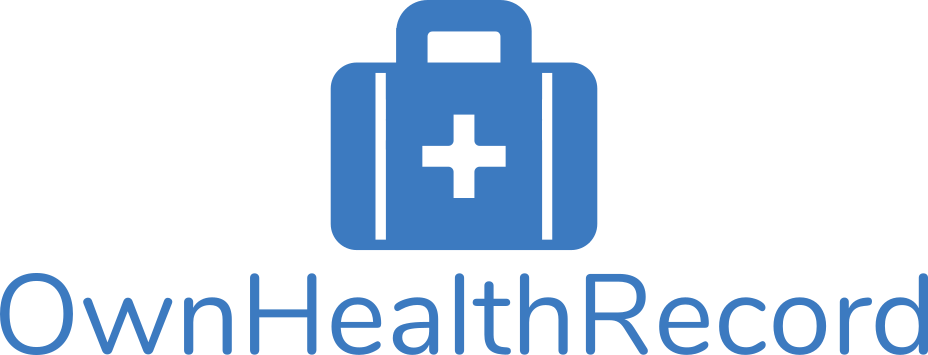
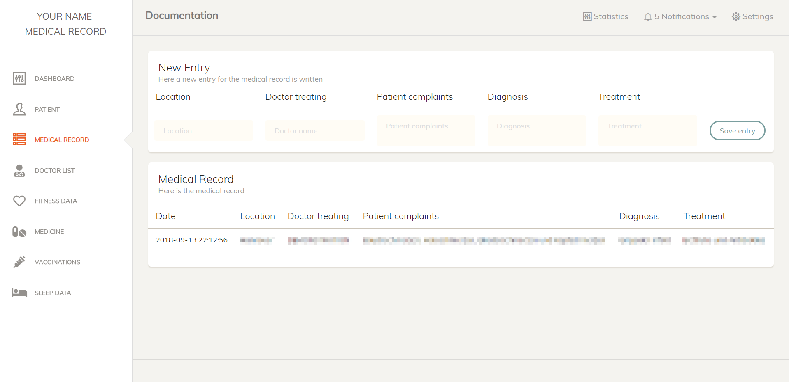

# OwnHealthRecord
This repository is about the Own Health Record Application Web App

Developed by <a href="https://github.com/petrk94" target="_blank">Petr Kirpeit</a>

# Newest update
You want to get every update without waiting for the next release?
Checkout the Developer Log, there you can see the latest changes and what was made, before it get finally released. 
---> <a href="DeveloperLog.md" target="_blank">DEVELOPER LOG</a>

## Whats about?
One problem I faced personally is, that I have different doctors and through traveling and moving to another cities, every doctor has only a snippet of my medical data records.
This can cause problems, due if Im sick and dont know the medical name for it, the doctor doesnt know about my health problems and so on.
For that reason, and because the German Insurances and Doctor Software Supplier are unable to get something working, I decide to make my own health record to have the medical history on my side.

## When it will be shared?
I made already a running proof of concept web app with the basic functionality, but its not yet ready for productive use and represent more an alpha (really, I suppose you dont want just to use a one page table).

# Requirements
* LAMP Stack
* PHP 7
* A MySQL/MariaDB database

The Web App is using PHP and MySQL, because its the most used environment you will find on nearly every server. This can be used on Root Server as well on SharedHost or VPS.

## SQLite?
Nope, sorry, for the moment I have no capacity to implement it as separate function. If you want to contribute to it, you are welcome to open an issue and discuss about it.

# How to use
Upload the files or clone the repo to your Document Root / html folder on your server, 
You have to create on mysql via PHPMyAdmin a new database and import the database-structure.sql file to your MySQL/MariaDB database. This will contain the tables medicalrecords, doctors, medicine, user.

### DB Connection
Go to the includes folder in your OwnHealthRecord directory and open psl-config.php, there you type in your database login credentials. In a future version this step will be replaced by a installer.

**Important: The Secret Key has to be changed by yourself, this is important to encrypt the data with AES_Encrypt** 

## Current Functionality
* medical-Record.php - here you can write down your personal medical record and get it    displayed what was saved in the database.

* doctors-list.php - here you can write and see all your doctors contact information as well the threatment time, so you will not forget when you was there and how long the doctor has cared about your health like, Threatment period 01.2018 - 10.2018.
  
* medicine.php - here you can add your medication, dosis, period of usage, link to a
  information website about the medicine you are taking and additional warnings by your doctor.

## Screenshot

Screenshot from V0.3

Screenshot from V0.1

## Attention - Safety - No guarantee
This software is build by my own, there is **no guarantee** for the safety or secure way that everything is working properly. It is made for selfhosting, so everyone has to take care about the server security and the way of protecting the data. For the login always use a https connection with valid SSL certificate. The Database entries are ~~not~~ encrypted, but this doesnt mean that its 100% secure. The password is hashed and salted.

## Your Own Server - Your Own Security
This application has to run on a secure environment. So if you run your own medical record on your own server, you have to take care about your own security to keep it running secure.

For that reason, I have collected for you some links which will help to run your server secure:

* https://www.digitalocean.com/community/tutorials/7-security-measures-to-protect-your-servers
* <a href="https://www.rackaid.com/blog/server-security-tips/" target="_blank">79 Server Security Tips for You to Secure Your Server</a>
* <a href="https://www.linode.com/docs/security/securing-your-server/" target="_blank">How to Secure Your Server</a>
* <a href="https://medium.com/viithiisys/10-steps-to-secure-linux-server-for-production-environment-a135109a57c5" target="_blank">10 steps to secure Linux Server for Production Environment</a>

## Third Party Libraries/Code/Sources

The Dashboard theme, developed by Creative Tim is the <a href="https://github.com/creativetimofficial/paper-dashboard" target="_blank">Paper-Dashboard</a> and is licensed by <a href="https://www.creative-tim.com/license/" target="_blank">Creative Tim under MIT License</a>.

The Account and Login Functionality code was made by Github User <a href="https://github.com/peredurabefrog" target="_blank">peredurabefrog</a>.
His <a href="https://github.com/peredurabefrog/phpSecureLogin" target="_blank">phpSecureLogin</a> Script is very helpful for the implementation of account functionality and to protect the information. 
Here is the code explanation: https://www.wikihow.com/Create-a-Secure-Login-Script-in-PHP-and-MySQL

The AES_Encryption code based on this tutorial about it:
http://thinkdiff.net/mysql/encrypt-mysql-data-using-aes-techniques/ by <a href="https://github.com/mahmudahsan" target="_blank">mahmudahsan</a>

https://www.w3resource.com/mysql/encryption-and-compression-functions/aes_decrypt().php
# Roadmap
- [ ] 2-Factor-Authentication
- [x] Encrypted medical information in MySQL Database
- [ ] SQlite3 Support
- 20% - Guardian (cron script which run in the background and detect changes in the code, if change detected, notify user about possible data breach)
- [x] nice login form
- [x] nice signup form
- 10% add allergies page (requested via reddit by @Laxmin)
- [ ] Upload functionality to upload medical images
- [ ] Timeline/log page, see all updates in your account (updates in medical record, uploaded images, reminder for health checks)
- [ ] Health Check reminder
- [ ] Reminder for vaccination (+ emailing function)